# AUDIT & KAIZEN — Knowledge Sources (Mạng nơ-ron & LLM/AI Agent) → Director Studio

Ngày: 2026-10-03 · Phạm vi: 8 file (SKILL.md trùng 100% bản đã xử lý; README.md; 6 video brief 01–06).
Mục tiêu: đấu nối lớp tri thức (brief + claim ledger) vào app Director Studio để thành **một hệ thống
tạo video thông minh**: tri thức có nguồn → brief → production board → prompt/lời đọc có kiểm chứng → QC → đăng.

## 1. Cấu trúc đã hiểu

```
knowledge/                      (không đính kèm — chỉ mô tả trong README)
├── ban-do-kien-thuc-mang-no-ron-ai.md     doc_id nn-knowledge-map-v1 · 50 nguồn [01]–[50]
├── ung-dung-mang-no-ron-llm-ai-agent.md   doc_id nn-llm-agent-v1   · 16 nguồn [01]–[16]
├── sources-index.json                      66 nguồn machine-readable
└── video-briefs/                          (đính kèm — 6 file)
    01..06-*.md  → 8 trường cố định:
      Nguồn(doc_id, mục, anchor [NN]) · Đối tượng · Góc mới (original-first) · Hook gợi ý
      · Dàn ý cảnh (4–6 ý) · Claim ledger (claim — anchor — VERIFIED) · Rủi ro/gate · Thời lượng & format
Pipeline mô tả: brief → POST /video/projects/auto-build → script → caption → claim ledger → AI register → risk score
```

Điểm mạnh cần giữ: cấu trúc 8 trường nhất quán; original-first rõ (chỉ lấy chủ đề + dữ kiện, góc kể viết mới);
claim ledger có anchor; gate rủi ro; format kỹ thuật khớp skill (60s · 1080x1920 · VO + sub · beat 0.15 + ducking);
nguyên tắc "mọi con số lấy từ công cụ, không để LLM tính nhẩm" (brief 05) — áp dụng ngược vào video: **mọi số liệu
trong lời đọc phải có anchor**.

## 2. Phát hiện audit

| # | Mức | Phát hiện | Bằng chứng | Kaizen |
|---|---|---|---|---|
| A1 | HIGH | Không brief nào có **CTA** — vi phạm §1 skill "CTA duy nhất" | cả 6 brief, trường Dàn ý kết ở "Kết:" | Thêm `cta` cấp series (mặc định) + cho phép ghi đè từng brief. Importer tự tạo cảnh CTA 5s cuối |
| A2 | HIGH | Số liệu trong hook **không có anchor** | brief 06: "90% là do bạn giao việc chưa rõ"; brief 02: "99% trên máy" | Quy tắc: số trong hook/lời đọc phải có anchor trong claim ledger, hoặc viết dạng giả định rõ ("giả sử 99%"). App lint tự bắt |
| A3 | MED | Anchor **không đồng nhất**: lẫn `[NN]` với "mục 3.5", "mục 1", "mục 3.2" → không tra được qua `sources-index.json` | brief 02, 04, 05 | Claim chỉ có "mục" → trạng thái `EDITORIAL` (biên soạn), không được coi là VERIFIED |
| A4 | MED | Brief 06 có **6 ý trong 60s** → mỗi cảnh ~7s, dưới ngưỡng 8–10s của skill §5 | brief 06 Dàn ý 1–6 | Hoặc 90s, hoặc gộp còn 3 nguyên tắc + "phần 2". Importer cảnh báo khi cảnh < 8s |
| A5 | MED | **Hai nhóm khán giả** khác nhau trong cùng thư mục: 01–03 học sinh/sinh viên; 04–06 chủ xưởng/kỹ thuật viên | trường Đối tượng | Tách 2 series: `nn-co-ban` và `ai-agent-doanh-nghiep`, mỗi series 1 character bible + 1 CTA |
| A6 | LOW | "Rủi ro / gate: **accuracy thấp**" mơ hồ (rủi ro thấp hay độ chính xác thấp?) | cả 6 brief | Đổi thành `risk_accuracy: low / medium / high` |
| A7 | LOW | Dòng "Thời lượng & format" **lặp y nguyên 6 lần** | cả 6 brief | DRY: đưa lên cấp series; brief chỉ ghi khi khác mặc định |
| A8 | LOW | Gợi ý minh họa **trừu tượng** ("mũi tên xoay vòng", "đường cong train/val") — cần neo bằng tay người / vật thật (skill 7c) | brief 01, 02 | Importer giữ ý nội dung làm **beat** của cảnh; AI shot-list dịch beat → SUBJECT/ENV/PROP/ACTION cụ thể |
| A9 | LOW | Thiếu gate **"gắn nhãn AI"** và **"ví dụ giả lập → ghi 'mô phỏng' trong caption"** ở cấp brief (README có, brief không) | brief 04, 05 (DH001) | Đưa vào QC nhóm "Claim & series"; lint caption khi brief có ví dụ giả lập |
| A10 | INFO | 3 file nền (2 bản đồ kiến thức + `sources-index.json`) **không đính kèm** → chưa đối chiếu được anchor | README | App lưu anchor dạng text, đánh dấu "chưa đối chiếu"; khi có index sẽ nạp để tra |
| A11 | INFO | Brief 03 yêu cầu **nhất quán mốc năm** với video trước (2012 AlexNet, 2017 Transformer) | brief 03 Rủi ro | Thêm `continuity` (ghi chú nhất quán) cấp dự án, in vào production pack |
| A12 | INFO | README nói brief < 2KB đi qua auto-build 20000 ký tự — ổn; nhưng auto-build là endpoint Kiemtien2026, không có trên Type | README | Director Studio đóng vai auto-build phía Type: parse brief → project; không gọi endpoint ngoài |

## 3. Kaizen đã thực hiện trong app (Director Studio v2)

1. **Intake brief** — dán hoặc upload nhiều file `.md` (định dạng v1 bullet hiện tại *và* v2 frontmatter) →
   parse 8 trường → tạo dự án: brief 5 ô, hook (tự đoán dạng), 6 cảnh theo dàn ý (hook 10s · ý · tóm tắt · CTA 5s),
   claim ledger, risk, series, continuity. Nhiều file = một series dùng chung character bible + CTA.
2. **Bước "Claim ledger"** mới — mỗi claim: text · anchors · VERIFIED / UNVERIFIED / EDITORIAL; nguồn doc_id/mục;
   risk level; continuity notes. Nút **AI đối chiếu lời đọc ↔ claim ledger** (chỉ gợi ý, người duyệt).
3. **Lint "mắt đạo diễn" mở rộng** — số liệu trong lời đọc/hook không có trong ledger; claim UNVERIFIED còn tồn;
   cảnh < 8s; caption thiếu chữ "mô phỏng" khi brief có ví dụ giả lập; thiếu CTA.
4. **⚡ AI dựng nháp** — một nút: điền shot list theo beat → viết lời đọc theo beat + chỉ dùng số liệu trong ledger.
5. **QC** thêm nhóm "Claim & series"; **production pack** thêm Nguồn, claim ledger, risk gate, continuity.
6. Ý nội dung từng cảnh (beat) hiển thị ngay trên production board và đưa vào prompt (SCENE INTENT).

## 4. Template brief v2 (đề xuất — app đọc được cả v1)

```markdown
---
brief_id: 01
series: nn-co-ban
doc_id: nn-knowledge-map-v1
section: 2
anchors: [41, 42, 44]
audience: học sinh, sinh viên mới tiếp cận AI
duration: 60
risk_accuracy: low
cta: Lưu video và theo dõi để xem phần tiếp theo của series
continuity: (mốc năm / số liệu phải khớp video trước)
---
# Video brief 01 — Mạng nơ-ron học như thế nào?

- **Góc mới (original-first):** ...
- **Hook gợi ý (0–3s):** "..."   ← không chứa số liệu chưa có anchor
- **Dàn ý cảnh:** (tối đa 3 ý + Kết cho 60s)
  1. ...
  4. Kết: ...
- **Claim ledger:**
  - "claim" — `[42]` `[44]` — VERIFIED
  - "claim biên soạn" — mục 3.5 — EDITORIAL
- **Rủi ro / gate:** ghi rõ ví dụ giả lập (nếu có) → caption phải có "mô phỏng minh họa"
```

## 5. Kiến trúc hệ thống tạo video thông minh (sau đấu nối)

```mermaid
flowchart LR
  K[Kho tri thức<br/>2 bản đồ + sources-index.json] --> B[video-briefs/<br/>8 trường + claim ledger]
  B -->|dán / upload .md| I[Director Studio · Intake<br/>parse → project + cảnh + claims]
  I --> P[Production board<br/>beat · SHOT · CAMERA · ACTION · cast]
  P -->|AI dựng nháp| S[Shot list + Lời đọc<br/>chỉ số liệu có anchor]
  S --> G[Prompt keyframe/motion<br/>→ CapCut / Seedance / generate_image]
  G -->|canhN.mp4 · vo-canhN.mp3 · beat.mp3| F[build.sh · ffmpeg<br/>1080x1920 · .ass · ducking]
  F --> Q[QC 4 lượt + Claim & series]
  Q --> T[TikTok · nhãn AI · caption 'mô phỏng' nếu giả lập]
  T -->|reach · 3s · xem hết · saves| K
```



## 6. Việc còn lại (ngoài phạm vi app)

- Đính kèm `sources-index.json` để app đối chiếu anchor tự động (hiện chỉ lưu & hiển thị).
- Quyết định A4 (brief 06: 90s hay gộp) và A5 (tách 2 series) — app đã hỗ trợ cả hai.
- Nếu muốn đẩy ngược vào Kiemtien2026 `auto-build`: production pack `.md` xuất từ app < 20000 ký tự, dán thẳng được.

## 7. Kết quả chạy thử parser (bun, trên file thật)

| Brief | Bản gốc v1 → app tự phát hiện | Bản v2 (kaizen) |
|---|---|---|
| 01 | thiếu CTA | sạch · series nn-co-ban · 6 cảnh 10/11.7/11.6/11.7/10/5s |
| 02 | thiếu CTA · hook "99%" không anchor · 1 claim chỉ "mục 3.5" → EDITORIAL | sạch · hook bỏ 99% · claim EDITORIAL ghi rõ |
| 03 | thiếu CTA · continuity 2012/2017 tự trích từ Rủi ro | sạch · continuity nằm trong frontmatter |
| 04 | thiếu CTA · 1 claim "mục 1" → EDITORIAL · ví dụ giả lập DH001 | nhắc caption "mô phỏng" (đúng ý) |
| 05 | thiếu CTA · 3/3 claim chỉ "mục" → EDITORIAL · risk medium | nhắc caption "mô phỏng" (đúng ý) |
| 06 | thiếu CTA · hook "90%" không anchor · 5 ý/60s → cảnh 7.5s | 90s → cảnh 13s · hook bỏ 90% |

Cả hai định dạng (v1 bullet, v2 frontmatter) đều nhập được vào app; v1 giữ nguyên không cần sửa tay.
