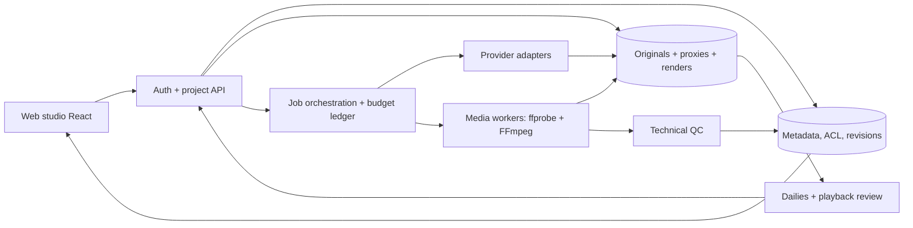

# Thiết kế sản phẩm và kiến trúc Cinema Studio

Đây là **kiến trúc đề xuất**, chưa phải tính năng đã triển khai. MVP ưu tiên phim ngắn hoàn chỉnh, dữ liệu bền vững và pipeline quan sát được. Không đào tạo model riêng hoặc xây toàn bộ công cụ compositing từ đầu.

## 1. Mục tiêu sản phẩm

Người dùng đưa ý tưởng, kịch bản hoặc footage vào một workspace; app hỗ trợ biên kịch, lập cảnh/quay, quản lý asset, tạo hoặc nhận các take, chọn take, dựng, làm tiếng/màu, review và xuất. Có thể kết hợp video quay thật, AI và đồ họa. “Nhà quay phim” ở đây là chức năng lập/quản lý shot và tạo media; app không tự điều khiển camera vật lý khi chưa có tích hợp.

Một tập phim là tập hợp scene có diễn biến và cảm xúc. Thêm một prompt “cinematic” vào slide không đủ. Công cụ AI cần có đầu ra review được, sửa được và truy ngược nguồn.

## 2. Màn hình và luồng sử dụng

| Không gian | Người dùng làm gì | Sản phẩm đầu ra |
|---|---|---|
| Project Hub | Tạo phim/series, chọn format, ngôn ngữ, ngân sách | Project brief + delivery profiles |
| Writers Room | Viết logline, scene beats, thoại, revision | Script/scene phiên bản được duyệt |
| Cast & World | Tạo nhân vật, costume, location, prop, reference | Bibles có version và rights status |
| Director Desk | Chọn blocking, shot size, camera/light, coverage | Storyboard, shot sheet, animatic |
| Production Board | Tạo/nhận keyframe/take, theo dõi job/chi phí | Take có metadata, lineage và trạng thái |
| Dailies & Continuity | So sánh take, ghi lỗi ở timecode, approve | Selected take và QC issues |
| Edit | Trim, reorder, transitions, J/L cuts, nhiều track | Timeline revision khóa được |
| Sound & Finish | Thoại, Foley, ambience, score, sub, shot match | Mix/color/subtitle revisions |
| Review & Delivery | Xem bản render, duyệt/feedback, chọn preset | Master, social version, stems, manifest |

Nút “Tạo phim” khởi chạy một kế hoạch có từng bước và chi phí dự kiến. Nếu thiếu footage hoặc provider, app chỉ rõ bước cần asset; không hiển thị thành công giả. Người dùng có thể sửa/duyệt từng stage hoặc cho tự động các bước đã đặt policy.

## 3. Phân tách kiến trúc

**Frontend:** tiếp tục React/TypeScript, chọn luồng nghiệp vụ Director Studio làm baseline UX, tách monolith App.tsx thành domain modules. TikTok Video Maker cung cấp tham chiếu Canvas/title/social preview, không ghép nguyên hai schema cùng tên projects. Preview phim dùng proxy media. Timeline thời gian lưu theo integer frame và rational frame rate, UI đổi sang timecode. Offline recovery lưu draft, không lưu credential.

**Metadata/auth:** có thể giữ Convex để giảm thay đổi ban đầu, bổ sung workspace membership/project ACL/version. Auth standalone phải là tích hợp thật độc lập khỏi Type host. Chọn một nguồn dữ liệu chính; không đồng thời thêm PostgreSQL nếu chưa có nhu cầu rõ.

**Media storage:** abstraction cho original, proxy, thumbnail, waveform, render và stems; signed upload/download, metadata thực, checksum, access scope và garbage collection. Có thể dùng object storage khi file video lớn; URLs tạm không là định danh canonical.

**Workers:** service riêng có FFmpeg/ffprobe, không render nặng trong transaction/query. MVP có thể chạy worker local; cloud sau khi có workload. Worker nhận signed lease từ job queue, sandbox job folder, kiểm soát CPU/RAM/disk/time, không nhận chuỗi shell tùy ý.

**Orchestration:** metadata lưu graph dependency; durable state, lease/heartbeat, retry policy, cancel, recovery và cost ledger. Không dùng browser tab làm nơi giữ trạng thái job dài.

**Provider adapters:** LLM, image, video, speech/alignment là các capability riêng. Mỗi adapter trả capabilities/version/limits; job hỗ trợ import thủ công khi API không khả dụng. Đăng ký capability chỉ sau smoke test và schema thực. Provider được lựa chọn bằng pilot cùng bộ test, không cố định theo tên trong skill cũ.

**Editorial handoff:** timeline JSON nội bộ + adapter OTIO khi cần đổi công cụ dựng. OTIO có mô hình timeline và adapter trao đổi; từng adapter phải test round-trip trim/fps/audio trước dùng. [Tài liệu OpenTimelineIO](https://opentimelineio.readthedocs.io/en/latest/).

## 4. Data model đề xuất

| Entity | Trường bắt buộc/quan trọng |
|---|---|
| Workspace / Membership | workspaceId, userId, role, active status |
| Project | workspaceId, title, profile, budgetPolicyId, currentRevision |
| Episode / Scene | projectId, order, scriptRevisionId, beat, locationId, start/end story state |
| ScriptRevision | parentRevisionId, text/structured beats, author, approval |
| Character / Location / Prop | bibleVersion, referenceAssetIds, invariants, rightsStatus |
| Shot | sceneId, objective, framing, camera/light/blocking, plannedFrames, continuityIn/Out |
| Take | shotId, sourceType, assetId, provider/modelVersion, promptVersion, status, QC, selected |
| Asset | workspaceId, immutable blobKey, sha256, type, probeMetadata, rightsId, derivedFrom |
| Job / Attempt | capability, inputHash, intentId, providerJobId, lease, status, retries, cost |
| TimelineRevision / Placement | projectId, revision, trackId, asset/takeId, sourceInFrame, durationFrame, timelineInFrame, gain/effects |
| Review / Issue | revision/takeId, frameRange, category, severity, comment, reviewer, resolution |
| RenderSnapshot / RenderJob | timelineHash, immutable inputAssets, profileVersion, rendererVersion, status |
| DeliveryArtifact | renderId, checksum, actual metadata, QC result, approval, file location |
| RightsRecord / AuditEvent | asset/person scope, evidence, expiry/restrictions; actor/action/resource/time |

Relationship: Project → Episode → Scene → Shot → Take → Asset. Timeline Placement dùng Take/Asset nhưng không sở hữu file. Selected take là lựa chọn có revision, không xóa các take còn lại. Đổi bible/reference phải đánh dấu các shot phụ thuộc cần review, không tự xóa hoặc sinh lại hàng loạt.

ACL được kiểm tra ở server trên workspace và resource. `read/write` capability của app hiện tại vẫn hữu ích nhưng chưa thay thế project permission. [Convex authentication](https://docs.convex.dev/auth/overview).

## 5. Hợp đồng ingest

Upload → finalize → probe → tạo proxy → QC → ready. Finalize kiểm tra upload thuộc workspace, size/MIME thực, checksum, dimensions, duration, fps/timebase, audio tracks, rotate metadata và quyền sử dụng. Browser chỉ hiển thị progress; file không ready thì timeline chưa được render final.

Original giữ nguyên. Proxy là derived asset có profile/version. Mọi transform ghi vào lineage; crop, silence/remove audio, speed và color change phải có thông số kiểm tra được.

Đường file và URL input đi qua allowlist và downloader giới hạn; chống truy cập network nội bộ/đọc file host khi worker nhận URL. FFmpeg gọi qua argument array từ schema, không nối prompt/fileName thành shell command.

## 6. Hợp đồng job và chống tính tiền trùng

Job states: `draft → queued → running → succeeded | failed | cancelled | outcome_unknown`. `outcome_unknown` không phải `failed`. Review take có states riêng: `unreviewed → approved | rejected | needs_changes`; render succeeded không đồng nghĩa approved delivery.

Khóa idempotency nội bộ: hash của `workspace + resource + inputRevision + operation + adapterVersion`. Lưu intent trước dispatch, providerJobId ngay khi nhận. Nếu provider có idempotency hỗ trợ, truyền khóa ổn định; nếu không, đối soát status/job history trước retry. Worker restart không được tự tạo generation mới khi outcome chưa biết.

- Lỗi validation/rights: sửa input, không retry nguyên trạng.
- Rate limit trước dispatch: backoff có jitter, tuân theo retry-after/quota.
- Lỗi có jobId hoặc response bị mất: poll/reconcile trước, không re-submit.
- Take sai chất lượng: tạo version mới với change reason, tính budget mới.
- Fallback Ken Burns/import: gắn `qualityMode`, không trình bày như clip diễn xuất đã đạt.

Ledger có `estimated`, `reserved`, `settled`, `released`, currency/unit và uncertainty. Admission control đặt trần theo project và bước; parallelism là config đo được theo provider, không hardcode 4. Khi gần budget cap, app dừng job mới và giữ kết quả hiện có.

## 7. Continuity engine thực dụng

Lưu identity/costume, prop state, thời điểm, ánh sáng, vị trí, eyeline, screen direction, trục hành động và input/output state theo shot. Rule checks phát hiện trường thiếu/mâu thuẫn; visual similarity chỉ là tín hiệu cho reviewer, không chứng nhận nhân vật giống hay diễn xuất tốt.

Ví dụ: shot A nhân vật lấy phong bì tay phải; shot B insert phải còn đúng tay, phong bì mở/đóng đúng thời điểm; reverse shot giữ screen direction phù hợp axis. Review issue liên kết take+frame, sinh lại đúng shot lỗi thay vì cả phim.

## 8. Render và sound

Render snapshot gồm timeline revision, asset hashes, subtitle/audio/color versions và delivery profile. Worker: preflight → normalize → compose picture/audio → encode → probe/QC → artifact. Bản preview và final dựa cùng semantics; chấp nhận khác chất lượng proxy, không khác cut.

Tracks: video, overlays, dialogue/VO, Foley, ambience, SFX, score và captions. Dialogue anchor thời gian; J/L cuts giữ audio độc lập khỏi picture. Audio source pad/trim và resample có chủ đích. Đo loudness/peak bản encode cuối, không chỉ nguồn WAV. FFmpeg có các filter mix, loudness, subtitle và scaling phù hợp cho pipeline này. [FFmpeg filters](https://ffmpeg.org/ffmpeg-filters.html).

MVP color: normalize/tag màu nguồn, exposure/WB, shot matching và look preset versioned trong SDR Rec.709. Không gán ACES/HDR hoặc “4K native” cho output từ source không đạt. Advanced conform/VFX/color grading chuyển sang editor ngoài qua handoff nếu tính năng app chưa đủ.

## 9. Delivery profiles ban đầu — mục tiêu nội bộ

| Profile | Đề xuất | Nghiệm thu |
|---|---|---|
| Cinema pilot | 1920×1080, 24fps, SDR Rec.709, MP4 H.264/AAC stereo; master chất lượng cao nếu có nhu cầu | 2160 frame cho phim 90s; source native/upscale ghi rõ; toàn phim xem/nghe được |
| Social adaptation | 1080×1920, fps thống nhất project, subtitle Việt tùy chọn | Reframe từng shot, text safe area, hợp đồng nền tảng được kiểm chứng lúc dùng |
| Review proxy | 720p theo tỉ lệ project, timecode watermark tùy chọn | Nhẹ, có revision label, không nhầm final |
| Editorial package | Original/proxy manifest, timeline JSON, OTIO khi adapter hỗ trợ, subtitle và stems | Kiểm tra link/relink và round-trip |

Loudness pilot web stereo có thể bắt đầu với −16 LUFS integrated, true peak ≤−1 dBTP; đây là **target nội bộ đề xuất**, không chuẩn Hollywood/broadcast chung. Cho phép profile khác theo kênh phân phối và người làm âm thanh. Không khẳng định 24fps/Rec.709/1080p tự tạo chất lượng điện ảnh.

## 10. Phạm vi MVP và mở rộng

MVP: private workspace, brief/script, scene–shot–take, manual media ingest, một video provider đã test nếu có, board/review, timeline video+audio+sub tối thiểu, durable render worker, QC và export. Asset import phải đủ làm phim ngay cả khi generation API chưa nối.

Sau MVP: coverage suggestions, waveform/alignment, comparison view, continuity assists, social adaptation, OTIO, team review, các provider bổ sung. Chỉ mở series/tập dài sau pilot 90s → phim ngắn 3–5 phút → thử workload một tập có thời lượng đã chốt.
