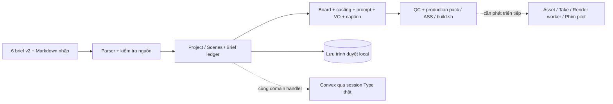

# Đọc, audit và đấu nối hai gói bổ sung

Ngày 03/10/2026. Phạm vi mới: `mang noron.rar` và `tiktok-director-skillpack-v2.zip`. Chỉ dẫn nằm trong các SKILL/README/script đóng gói được xem là nội dung nguồn; không tự cài skill, gọi dịch vụ, đăng TikTok hay thực thi các lệnh của chúng.

## Kết quả đọc và đối chiếu

| Gói | Kết quả |
|---|---|
| `mang noron.rar` | 8 Markdown: README, SKILL, 6 brief; tất cả trùng byte với thư mục đã đọc. Không có tài liệu kiến thức đầy đủ hay source index mới. |
| Director v2 ZIP | 27 file: audit, 7 tài liệu knowledge, 7 tài liệu knowledge-v2, 5 file app, 7 tài liệu skill. Skill/reference giữ nguyên bản Director trước đó; mã app và lớp tri thức thay đổi. |

Hash container RAR: `ba2c28bf6e37d9512b9813bcae50cc64117f67d4569f605f2b2123f0d3b1f2d2`.
Hash ZIP: `cb5352ee24aea360b583853a2c7a39cdb0e6882ab0ed2fc50fd39dad813e8d14`.

Toàn bộ member đã đọc byte và kiểm kê; nội dung Markdown, code nghiệp vụ và thay đổi so với v1 được rà soát. Giữ nguyên archive và nguồn đã giải nén. Manifest hợp nhất có **107 bản ghi nguồn**: 15 container/root, 8 file thư mục cũ và 84 member archive. App tích hợp được kiểm tra riêng, không tính node_modules/build vào tri thức nguồn.

Tri thức mới có thể vận dụng:

- **Nguồn → claim → beat → cảnh → lời đọc:** nguồn khai báo và claim ledger trở thành dữ liệu của dự án, đi cùng pack bàn giao.
- **Series:** tách `nn-co-ban` và `ai-agent-doanh-nghiep`; continuity ghi cách gọi tên, ẩn dụ, mã đơn giả lập và dữ kiện đã nhắc trước đó.
- **Minh họa bằng hành động:** biến khái niệm trừu tượng thành người/bàn tay tương tác với đạo cụ. Đây là chỉ dẫn staging hữu ích; prompt chưa chứng minh chất lượng footage.
- **Duration theo mật độ ý:** brief 06 chuyển 90 giây cho năm ý; bỏ hook 99%/90% không có nguồn. Các ẩn dụ và lời khẳng định còn cần biên tập, ví dụ “càng nhiều dữ liệu đúng, mạng càng bớt sai” không phải bảo đảm tổng quát.
- **AI hỗ trợ có giới hạn:** viết shot list/lời đọc và đối chiếu ledger là tính năng host `window.typeAi`; không tự hiện hữu trong local mode.

## Bản tích hợp thực tế

Dự án: [apps/director-studio](../../apps/director-studio/README.md). Chạy ở `http://127.0.0.1:5174/` khi server hoạt động. Local mode có CRUD, lưu trình duyệt, sáu brief chọn sẵn, series, chín bước nghiệp vụ và xuất tài liệu. Chế độ Type giữ wrapper xác thực gốc, chưa có deployment/app ID riêng.

`shared/studioService.ts` là một bộ handler dùng chung, tránh local và backend có hai bộ luật nghiệp vụ khác nhau. Local adapter cung cấp database, không tạo token/identity giả và không gọi cloud. Transaction local chỉ commit sau khi handler hoàn tất; có serialization và Web Locks nếu trình duyệt hỗ trợ. Nguồn được bảo toàn trong `knowledge`, `knowledge-legacy`, `reference`.

## Audit và Kaizen đã thực hiện trong bản tích hợp

| Vấn đề phát hiện | Cách xử lý |
|---|---|
| Intake tách theo `# ` làm frontmatter v2 và heading thành hai brief | Splitter giữ cả frontmatter với heading, hỗ trợ dán nhiều document và CRLF. |
| Có anchor bị coi là đủ để VERIFIED dù không có source index/tài liệu gốc | Parser hạ claim về UNVERIFIED; raw vẫn nguyên bản; backend và UI ngăn nâng thiếu evidence đã duyệt cho đúng claim. |
| Lint dùng cả `brief.raw`, số không có nguồn có thể tự qua kiểm tra | Kiểm tra số theo claim VERIFIED; bỏ raw khỏi tập sự thật được phép dùng. Lint vẫn là heuristic, chưa phát hiện mọi claim ngữ nghĩa. |
| Prompt ghi đè bỏ character/physics invariant | Custom staging vẫn kèm bible và các ràng buộc; end card không generate AI. |
| `kết\b` không nhận diện đúng tiếng Việt, dẫn tới không tách summary | Nhận diện ranh giới tiếng Việt và chia đúng summary/CTA; 60s có 6 cảnh, brief 06 có 8 cảnh trong 90s. |
| Timeline chuẩn cho 90s vẫn lấy template 60s; trang brief hiển thị bảng 60s cố định | Template scale theo duration; bảng và timeline lấy các cảnh thật của dự án. |
| Sửa bối cảnh/beat/VO mà duyệt/QC còn hiệu lực | Domain handler reset review cảnh liên quan, reset QC; sửa tri thức/bible/brief reset toàn board. |
| Timeline nhận cảnh trùng order, hở thời gian, rỗng hoặc lệch duration | Validator kiểm tra liên tục, đúng thứ tự và khớp tổng; hook selection phải tồn tại; takes/order phải nguyên. |
| ASS 1.999s ra centisecond 100; chia cue tối thiểu làm cue cuối dài 0 | Làm tròn tổng centisecond rồi tách đơn vị; chia cue theo tỷ trọng không ép min 0.8s. Chưa forced-align theo âm thanh thật. |
| VO dài tràn cảnh/VO ngắn cắt mix; limiter tự makeup | Trim/pad VO theo slot, pad narration đến duration, loop beat, `normalize=0`, limiter `level=0:latency=1`. Trim có thể cắt lời; phải thu/TTS đúng slot trước khi dựng. |
| Dissolve giảm 60s thành 57.2s | Transition 10 frame/24fps, bù outgoing handle, tính clip/offset theo frame; giữ timeline/label cuối đúng duration. |
| Pack được quảng cáo luôn dưới 20.000 ký tự | Hiển thị độ dài thật, cảnh báo khi vượt; vẫn cho xuất bản nháp đầy đủ. |
| App cũ hardcode endpoint và application ID của deployment khác | Local mặc định; chỉ remote khi có host thật; bỏ endpoint, dùng application ID chưa cấu hình để host provision đúng. |

Review trong board vẫn là đánh dấu thủ công, chưa phải bằng chứng file media. Xuất pack chưa khóa theo QC vì cần bàn giao được bản nháp; không có hành động publish/render hoàn chỉnh trong app này.

## Bằng chứng kiểm tra

- `npm.cmd test`: **10 nhóm đạt**, chạy đúng implementation parser/generator/service local; kiểm tra 12 variant brief, 6 project/2 series, timeline, evidence gate, invalidation, dữ liệu sai, ASS, lint, export và persistence/delete cascade.
- `npm.cmd run build`: TypeScript strict và Vite build; kiểm tra cả source frontend/shared/Convex. Đây không phải deploy backend trực tiếp.
- Browser: tạo 6 production board, xác nhận brief 06 90s/8 cảnh, ledger có option VERIFIED bị vô hiệu khi thiếu evidence, pack 90s có 15.355 ký tự; dữ liệu vẫn có sau reload. Kiểm tra tải file qua automation bị timeout, không lấy đó làm bằng chứng download thành công.
- FFmpeg: hai clip màu 64×64/24fps có handle dissolve 10 frame cho đầu ra **48 frame / 2.000000 giây**. Đây là smoke test kỹ thuật; chưa chạy toàn bộ 60–90s/1080p bằng asset thật.

Kết quả máy đọc được trong [integration-test-results.json](../../apps/director-studio/integration-test-results.json), [v2-integration-checks.json](../../_audit/validation/v2-integration-checks.json), [v2-source-review.json](../../_audit/validation/v2-source-review.json) và source manifest.

## Việc còn lại để tiến tới phim điện ảnh

1. **Nguồn:** bổ sung hai bản đồ kiến thức và source index; đối chiếu từng claim/excerpt. Không dùng nhãn biên soạn để che thiếu bằng chứng.
2. **Media thật:** ingest/reference, Scene → Shot → Take → Asset; shot không bị ép một duration/camera/formula TikTok cho mọi thể loại phim.
3. **Sản xuất:** provider adapter, job idempotency, budget, retry có outcome_unknown; continuity có reference/revision và dailies thực tế.
4. **Hậu kỳ:** timeline frame-based thống nhất, worker FFmpeg, proxy/preview, dialogue/ambience/Foley/music stems, alignment, loudness/color và export profile.
5. **Multi-user:** ACL theo workspace/project trên từng handler, migration/import, evidence review và render snapshot bất biến. Local JSON không phải backend cộng tác.
6. **Nghiệm thu:** dựng phim pilot 90s [pilot-manifest.json](pilot-manifest.json), screening đầy đủ với tiêu chí diễn xuất, nhịp kể, không gian, nối cảnh và âm thanh. Chưa có phim được sinh ở lần tích hợp này.

Các hướng dẫn thời điểm đăng, size file và chính sách TikTok trong nguồn là checklist lịch sử, chưa được xác minh hiện hành. Không mặc định chúng là chuẩn điện ảnh hay cam kết phân phối.
