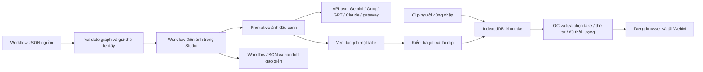

# Workflow Trang 9 → Director Studio → API → Vercel

Ngày: 03/10/2026. Nguồn được đọc như dữ liệu sản xuất, không phải lệnh cài đặt, quyền gửi key hoặc yêu cầu chạy model từ tài liệu.

## Kết quả đọc toàn bộ workflow

SHA256 nguồn: `6ebf84c88a9e435163cebafd75bfa36cccbba5542b1527b201cfc7bd749eb760`.

| Thành phần | Số lượng | Nội dung thực tế |
|---|---:|---|
| Group | 2 | Nhóm hiển thị; không phải worker/queue |
| imageReference | 1 | Bảng minh họa “Episode 3 — Master Asset Reference Sheet”: Daniel, Anna, nhân vật phụ, infected/stalker, metro, thành phố/nhà thờ, North Bridge, bệnh viện và đạo cụ |
| textPrompt | 26 | Một prompt đầy đủ, 25 prompt trống |
| videoGenerate | 26 | 20 cấu hình Dola/Seedance 2.5 × 30s; sáu Google/Veo Lite × 8s; tất cả chưa có generatedAsset |
| videoMerge | 2 | Dây nguồn giữ thứ tự 20 cảnh và sáu cảnh, chưa có video ghép |
| Edge | 78 | 26 ảnh→video, 26 prompt→video, 26 video→merge |

Prompt hiện có: horror live action trong metro control room, Daniel/Anna/Survivor, tiếng cào trong ống thông gió, điện tắt, shadow Stalker thoáng qua, kết thúc ở cửa mở. Ràng buộc: ánh sáng practical, camera có kiểm soát, sound design, không gore/chữ/watermark. Prompt chứa nhiều beat và thoại; không nhét nguyên 30s nội dung vào clip 8s rồi coi là đủ cảnh.

Ảnh nguồn là **bảng asset vẽ**, không phải năm file ảnh đầu cảnh riêng hoặc ảnh diễn viên live action. Nó giúp continuity về mặt thiết kế; không bảo đảm danh tính trong video. Không tự đổi nhân vật hoặc tự điền 25 prompt còn trống.

## Điểm đấu nối và Kaizen

App tiền kỳ chín bước vẫn hoạt động với sáu brief v2; các nút AI đã nối chung `providerClient`. Bước QC/bàn giao có xuất project→workflow, giữ thứ tự/thời lượng cảnh, character bible, prompt và format 9:16. Nhập JSON xuất đó vào tab Workflow để tiến sang take/QC/render. Phần workflow tách khỏi schema brief TikTok 1–12 cảnh, vì Trang 9 có 26 cảnh và hai nhánh phim dài hơn; không ép vào board 90s và làm mất cảnh.

| Audit | Sửa / hành vi |
|---|---|
| Prompt trống và cấu hình model không có hợp đồng API | Báo từng cảnh; giữ metadata Dola/Seedance, không gọi endpoint đoán |
| Model nguồn `veo-3.1-lite` không phải ID REST đầy đủ | UI tạo mới dùng `veo-3.1-lite-generate-preview`; bản nguồn giữ nguyên |
| Cảnh 30s và Veo 4/6/8s | Chọn nhiều take, tính đủ thời lượng, cắt phần dư cuối; chặn ghép khi thiếu footage |
| Dây ghép thiếu thứ tự scene rõ ràng | Giữ đúng thứ tự edge nguồn; kiểm tra bằng test so trực tiếp JSON gốc |
| Một ảnh minh họa chứa nhiều asset | Hiển thị bảng gốc, cảnh báo ý nghĩa ảnh đầu; cho nhập ảnh đầu riêng theo cảnh |
| Khoá trong browser persistence hoặc bundle | Key nhập chỉ ở memory; key server qua env; không VITE_ secret; JSON export không chứa key |
| API bị dùng công khai với key của chủ web | Yêu cầu STUDIO_ACCESS_TOKEN trên Vercel; kiểm tra Origin và token trước gọi provider |
| “Key miễn phí” bị hiểu là mọi model miễn phí | Allowlist theo model, xác nhận account free, cost gate 402, trả 429 thì dừng |
| Fallback có thể phát sinh phí | Không có fallback tự động; người dùng đổi provider và bật paid rõ ràng |
| Custom endpoint có thể chuyển tiếp key sang địa chỉ lạ | Chỉ cấu hình owner, HTTPS, kiểm tra IP/mạng riêng; text không theo redirect; media chỉ Google Files/Storage, bỏ key khi đổi host |
| Job vòng lặp trong serverless bị mất khi function kết thúc | Tạo/poll/download riêng; operation metadata lưu ở browser; Google giữ job |
| QC/selection cập nhật liên tiếp có thể ghi đè | Patch từng field bằng transaction IndexedDB |
| Browser render không có feedback hoặc file preview | Progress, hủy, video xem trước, link tải; dọn URL/stream/AudioContext |

## Provider và chính sách chi phí

| Provider | Hợp đồng | Free trước | Sinh video |
|---|---|---|---|
| Google | generateContent / predictLongRunning / operations | Gemini 2.5 Flash/Flash Lite theo free-tier account | Veo 3.1, phải cho phép credit/paid |
| Groq | Chat Completions | Llama 3.3 70B, GPT OSS theo free quota tài khoản | Chưa có adapter |
| OpenAI | Responses API, store:false | Không mặc định giả định có free quota | Chưa có adapter |
| Anthropic | Messages API | Không mặc định giả định có free quota | Chưa có adapter |
| APMIX | OpenAI-compatible Chat Completions | Claude Sonnet 4.6 Free theo danh mục chính thức; quota/account vẫn phải kiểm tra | Chưa xác minh API video |
| Experiential Labs | OpenAI-compatible Chat Completions | Owner khai báo model free đã kiểm tra trong tài khoản | Chưa xác minh API video |
| Custom | HTTPS OpenAI-compatible Chat Completions | Owner khai báo CUSTOM_FREE_MODELS | Chưa có adapter |

Allowlist là chính sách app, không phải xác nhận billing từ provider. Không có API chung chứng minh key đó đang miễn phí. Bảng giá, model và quota có thể thay đổi. Khi nhận 429, API dừng và nói rõ không chuyển trả phí.

Nguồn đối chiếu chính thức: [OpenAI quickstart](https://developers.openai.com/api/docs/quickstart), [Claude API](https://platform.claude.com/docs/en/api/overview), [Gemini pricing](https://ai.google.dev/gemini-api/docs/pricing), [Veo REST](https://ai.google.dev/gemini-api/docs/veo), [Groq quickstart](https://console.groq.com/docs/quickstart), [Groq rate limits](https://console.groq.com/docs/rate-limits), [APMIX docs](https://apmix.ai/docs), [APMIX model catalog](https://apmix.ai/models), [Experiential API](https://platform.experientiallabs.ai/docs), [Vercel Node functions](https://vercel.com/docs/functions/runtimes/node-js).

## Nguồn Grop xuất hiện trong workspace

Giữ `Grop/` và `Grop.rar` làm nguồn tham khảo API Pro. Chúng dùng NestJS/Prisma, @orh/crypto, AuditLog, safe-fetch, tool-registry, Next hooks và controller/schema khác chưa có trong gói này. Không ghép nguyên service vào Vercel rồi coi các dependency đã tồn tại. Đã tiếp thu router provider, key server, usage và job; tách adapter nhỏ chạy được trong stack hiện tại.

Một số mô tả nguồn ghi model gateway “FREE/test chạy tốt” mà không có bằng chứng key/live call trong phiên này. App không lấy mô tả đó làm kiểm chứng. Model APMIX free được tra lại từ catalog chính thức; model list tải từ tài khoản thay vì cố định toàn bộ ID cũ. Fallback tự động trong nguồn Grop không được dùng vì xung đột yêu cầu free trước và kiểm soát trả phí.

## Kiểm tra và giới hạn

10 nhóm integration tiền kỳ; năm nhóm workflow (hash gốc, toàn bộ graph, edit prompt/validation, nhiều take/QC/thời lượng, cầu nối production board); 11 kiểm tra API mock (wire contract, cost gate, quota, redirect, media URL, endpoint private, token/origin, lỗi không lộ secret). Build TypeScript và Vite pass.

Kiểm tra browser: graph 26 cảnh/hai nhánh hiển thị, Veo bị chặn khi chưa bật chi phí; nhập workflow thử và hai clip 2s có AAC; lưu IndexedDB, QC/select, timeline đủ 4s; dựng ra Blob WebM và video xem trước trên trang. Tự động bắt download Blob trong in-app browser timeout, nên chưa xác nhận file tải qua automation hoặc kiểm tra ffprobe bản WebM đó. Không suy từ video xem trước sang độ chính xác frame/audio của phim dài; cần nghiệm thu ở Chrome/Edge thông thường và pilot.

Không gọi API live bằng key của người dùng; chưa xác minh quota, ảnh→video hay download URI trên tài khoản cụ thể. Download Google chỉ theo tối đa ba redirect trong allowlist Files/Storage; không gửi API key sang Storage. Destination khác bị chặn để kiểm tra trước. Thời lượng/mime/resolution thực tế do provider trả; xem clip trước QC.

Web hiện là studio cá nhân, lưu per browser/domain. Chưa có user authentication/tenant DB, cloud asset storage, durable render queue, dự toán chi phí thời gian thực, color grading, nhạc nhiều track hoặc phim pilot đầy đủ. Studio token là quyền truy cập API chung, không phải hệ thống nhiều người dùng. Không chạy FFmpeg dài trên Vercel Function.

Deploy từ root repository, main, giữ config vercel.json và đặt STUDIO_ACCESS_TOKEN. Khoá provider có thể đặt server hoặc nhập BYOK từng phiên. Sau deploy cần smoke-test API bằng key/quota thực tế rồi nghiệm thu một cảnh ngắn trước khi mở cả episode.
